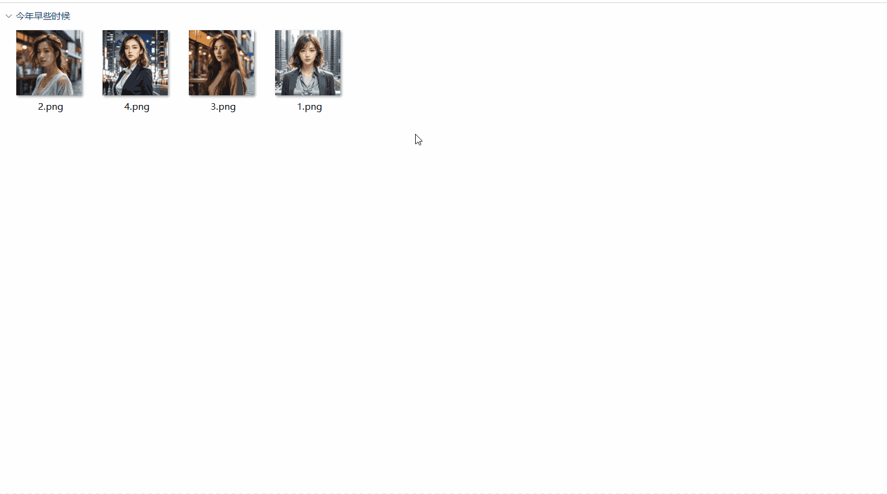

# 图片加圆角脚本

> 为图片添加抗锯齿圆角，多图批量处理，可输出到指定目录或源图片目录。

---

## 核心特性

- **抗锯齿圆角**：基于距离场的 smoothstep 插值，边缘平滑无锯齿
- **半径可调**：圆角半径 0–200px 自由调节，实时预览
- **多图批量**：一次性添加多张图片，点「确定添加圆角」统一处理
- **输出位置可选**：留空则输出到各图源目录；也可指定统一输出目录
- **文件名后缀可配**：默认 `_rounded`，输出为 `原名_rounded.png`
- **透明通道**：输出 PNG 保留透明背景，预览区棋盘格显示透明区域
- **格式支持**：JPG / JPEG / PNG / WebP / BMP / GIF（WebP 经 WASM 解码）
- **配置自动记忆**：半径与输出设置自动保存，下次打开沿用
- **离线可用**：纯本地处理，无任何外部服务

---

## 脚本演示



---

## 安装方法

本脚本的运行环境、依赖组件及图形化窗口均依赖「不忙脚本盒子」，建议仅通过盒子安装和使用。

> 前置条件：安装好 [不忙脚本盒子](https://www.bm-box.cn)

* 打开盒子 → **脚本市场** → 搜索 **「图片加圆角」**
* 点击「安装」，等待安装完成


---

## 使用方式

- **打开窗口**（任意方式都会弹出配置窗口）
  - 在盒子主界面点击「图片加圆角」卡片
  - 在盒子「热键管理」为该脚本绑定快捷键后按下
  - 在文件夹中选中图片 → 右键 → 不忙脚本盒子 → 图片加圆角

- **添加图片**（三选一，可混合）
  - 点「添加图片」：打开系统文件对话框，可多选（记住源目录）
  - 点「选择图片」：用系统文件选择器多选
  - 直接把图片拖进预览区

- **设置并输出**
  - 拖动「圆角半径」滑块，左侧缩略图可切换/移除/清空
  - **输出目录**：留空则保存到每张图片所在目录；也可点「浏览」指定统一目录
  - **文件名后缀**：默认为 `_rounded`，输出为 `原名 + 后缀 + .png`
  - 点「确定添加圆角」，逐张处理并显示进度

- **完成**
  - 全部成功：提示「已输出 N 张」，窗口自动关闭
  - 有失败：窗口保留并显示失败原因，便于调整后重试

---

## 🔗 作为节点被调用（脚本联动）

本脚本已声明为节点（`[bmscriptsbox.node] enabled = true`），可被其他脚本通过 `/api/link` 同步调用：不弹窗口、不等待输入，静默处理并把结果写入信封。

- **输入**：`target_paths`（图片路径数组）
- **运行参数**

  | 参数 | 类型 | 默认 | 说明 |
  | --- | --- | --- | --- |
  | `radius` | int | 12 | 圆角半径（px），0 表示不加圆角 |
  | `output_dir` | str | 空 | 输出目录；留空则输出到各图片源目录 |
  | `suffix` | str | `_rounded` | 输出文件名后缀 |

- **输出（信封）**

  | 键 | 类型 | 说明 |
  | --- | --- | --- |
  | `code` | int | 0 成功；非 0 失败 |
  | `msg` | str | 结果说明 |
  | `files` | list | 处理成功的输出文件路径列表 |
  | `count` | int | 处理成功的数量 |

调用示例（调用方脚本）：

```python
import json, sys, requests

env = json.load(open(sys.argv[1], encoding='utf-8'))['environment']
r = requests.post(f"{env['api_base']}/api/link", json={
    "script_id": "7f9b3c2d-1e5a-4b8c-9d0e-6f1a7b2c3d4e",   # 本脚本 id
    "data": {"target_paths": ["C:/a/photo.jpg"]},
    "params": {"radius": 16, "output_dir": "C:/out", "suffix": "_rounded"},
}, timeout=3600)

result = r.json()["result"]
if result.get("code") != 0:
    raise RuntimeError(result.get("msg"))
print(result["files"])   # 输出文件路径列表
```

> 修改 TOML 后需在盒子中**重新安装 / 更新**本脚本，节点声明才会生效。

---

## 💡 使用提示

- 通过右键/快捷键触发时，已在文件管理器中选中的图片会自动带入窗口。
- 拖拽添加的图片拿不到源目录，若「输出目录」留空将无法保存，请先指定输出目录。
- 圆角半径超过图片短边一半时自动按最大可用值处理。
- 输出格式固定为 PNG（保留透明通道）；文件名后缀建议不为空，以免与源文件重名。

---

## 🖥️ 环境要求

| 项目 | 要求 |
| --- | --- |
| **操作系统** | Windows 10 1803+（64 位） |
| **运行环境** | Node.js >= 16（盒子自动下载） |
| **外部工具** | webview-cli（盒子自动下载） |
| **运行依赖** | `jimp`、`@jsquash/webp`（盒子自动安装） |

---

## 更新日志

- v1.4.0（当前最新版）
  - 声明为节点脚本，支持被其他脚本联动调用（`/api/link`），信封回传 `files` / `count`
  - 新增运行参数 `radius`、`output_dir`、`suffix`，节点与定时任务可传入
